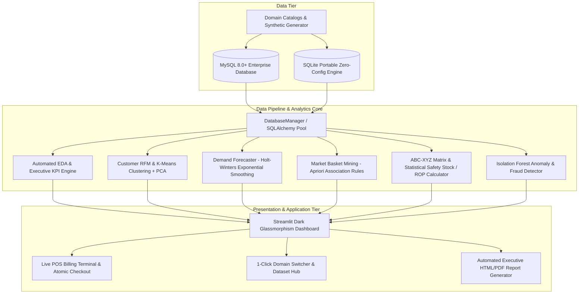

# ⚡ Outlook360
### Universal Enterprise Business Intelligence, Inventory Optimization & Predictive Analytics Platform
*A Major MCA 3rd Semester Flagship Project in Python, MySQL, and Data Science*

[](https://www.python.org/)
[](https://www.mysql.com/)
[](https://www.sqlite.org/)
[](https://streamlit.io/)
[](https://scikit-learn.org/)
[](https://plotly.com/)

---

## 🌟 Project Overview
**Outlook360** is an enterprise-grade, domain-agnostic Business Intelligence (BI), Inventory Optimization, and Predictive Analytics platform built from scratch in **Python and MySQL/SQLite**.

The project uses a **Universal Relational Schema (3NF)** and modular data science pipelines that allow the entire application to instantly adapt to **6 distinct commercial industries** with a single click:
1. 🛒 **Supermarket & Grocery** (Perishables, Dairy, FMCG, Packaged Foods)
2. 💊 **Pharmacy & Healthcare** (Prescription Rx, OTC Cold/Pain, Diagnostics, Supplements)
3. 🍽️ **Restaurant & Cafe** (Starters, Artisan Pizzas, Pastas, Combos, Peak Rush Hours)
4. 👗 **Fashion & Apparel** (Men's Suiting, Casuals, Women's Wear, Footwear, Leather)
5. 📱 **Electronics & Mobile** (Smartphones, Computing, Audio, Accessories, Attach Rates)
6. 📦 **E-Commerce Direct (D2C)** (Home & Kitchen, Fitness, Beauty, Multichannel Logistics)

---

## 🏛️ System Architecture



---

## 🚀 Key Features & Data Science Modules

### 1. 📊 Executive BI & Financial Overview
- Real-time gross revenue, net profit margin, Average Order Value (AOV), and customer counts.
- Daily revenue and profit trajectory charts with shaded area fills.
- Month-over-Month (MoM) growth pacing tables and department contribution breakdowns.
- 7-day $\times$ 24-hour **Operational Traffic & Footfall Heatmap**.

### 2. 📈 Sales & Pareto (80/20) Analytics
- Identification of the **Vital Few (Top 80% revenue drivers)** vs **Useful Many (Bottom 20%)**.
- Dual-axis interactive Pareto chart (individual product bars + cumulative percentage curve).
- Payment method & sales channel revenue share donut charts.

### 3. 👥 Customer Segmentation (RFM + K-Means + PCA)
- **Recency, Frequency, Monetary (RFM)** quantile scoring and rule-based persona tagging.
- Log-transformed feature standardization (`StandardScaler`).
- Unsupervised **K-Means Clustering** with **Elbow Method (Inertia)** and **Silhouette Score Analysis**.
- Dimensionality reduction via **Principal Component Analysis (PCA)** for interactive **2D & 3D cluster landscapes**.

### 4. 🔮 Predictive Demand & Revenue Forecasting
- Multi-horizon time-series forecasting (7 to 90 days ahead) using **Holt-Winters Triple Exponential Smoothing** (trend + 7-day weekly seasonality).
- Strict out-of-sample test partitioning with error evaluation metrics: **MAE, RMSE, MAPE**, and **$R^2$ Score**.
- Statistical **95% Confidence Interval prediction bands**.

### 5. 🛒 Market Basket Analysis & AI Cross-Sell Recommender
- Association rule mining using the **Apriori Algorithm** (`mlxtend`).
- Metric calculations: **Support, Confidence, Lift, Leverage, and Conviction**.
- **Live Cross-Selling Recommender**: Select any product in the cart to receive instant high-lift recommended bundle add-ons!

### 6. 📦 Smart Inventory Optimization & Supply Chain Intelligence
- **9-Box ABC-XYZ Matrix**: Classifies products by cumulative revenue share (ABC) and demand volatility coefficient of variation (XYZ).
- Statistical **Safety Stock** formula: $SS = Z \times \sqrt{L \times \sigma_d^2}$ (configurable 90%, 95%, 98%, 99% service levels).
- Dynamic **Reorder Point (ROP)** formula: $ROP = (\bar{d} \times L) + SS$.
- Early-warning stockout and overstock radar with suggested replenishment order quantities.

### 7. 🚨 Transaction Anomaly & Fraud Detection
- **Isolation Forest (Unsupervised Tree Ensemble)** for anomaly detection across order attributes.
- Statistical Z-score outlier detection for extreme transaction amounts and unauthorized discount surges.
- Automated AI root-cause diagnosis for flagged invoices.

### 8. ⚡ Real-Time POS Billing Terminal
- Interactive billing terminal with customer lookup, tier discounts, tax calculation, and live cross-sell recommendations.
- Executes **atomic ACID transactions** directly into the database, decrements inventory stock, and logs stock ledgers in real-time.

### 9. 🌐 Domain Switcher & Dataset Manager
- Switch the entire enterprise database between Supermarket, Pharmacy, Restaurant, Fashion, Electronics, and E-Commerce in 1 click!
- Download any relational table as CSV with one click.

### 10. 📄 Executive BI Report Generator
- Automated compiler generating formatted, printable executive HTML/PDF business intelligence reports.

---

## 🛠️ Tech Stack

| Domain | Technologies |
|---|---|
| **Core Language** | Python 3.10+ |
| **Databases** | MySQL 8.0+ (Production) & SQLite (Zero-Config / Portable) |
| **Database Connectors** | SQLAlchemy 2.0+, `mysql-connector-python` |
| **Data Processing & Stats** | Pandas, NumPy, Scipy |
| **Machine Learning** | Scikit-Learn, Statsmodels, MLxtend |
| **Data Visualization** | Plotly Express & Graph Objects, Matplotlib, Seaborn |
| **Frontend / Dashboard** | Streamlit + Custom Dark Glassmorphism CSS |
| **Synthetic Data & Utils** | Faker, Python-Dotenv, Jinja2, Openpyxl |

---

## 📂 Project Directory Structure

```text
m:/SMT/
├── config/
│   ├── __init__.py
│   ├── database_config.py          # MySQL and SQLite configuration manager
│   └── settings.py                 # Global application parameters
├── database/
│   ├── __init__.py
│   ├── connection.py               # Singleton SQLAlchemy engine & query executor
│   ├── schema.sql                  # ANSI SQL 3NF Relational Schema with indexes
│   ├── seed_data.py                # Database population & domain seeder
│   └── queries.py                  # Optimized analytical SQL queries
├── data_generators/
│   ├── __init__.py
│   ├── domain_configs.py           # Catalogs & co-purchase affinities for 6 domains
│   └── synthetic_generator.py      # Statistical synthetic transaction engine
├── ml_engine/
│   ├── __init__.py
│   ├── eda_engine.py               # Automated EDA & Executive KPI calculations
│   ├── rfm_segmentation.py         # Customer RFM + K-Means + PCA pipeline
│   ├── demand_forecaster.py        # Holt-Winters time-series demand forecasting
│   ├── market_basket.py            # Apriori association rule mining & cross-sell
│   ├── inventory_optimizer.py      # ABC-XYZ Matrix & Safety Stock / ROP engine
│   └── anomaly_detector.py         # Isolation Forest transaction anomaly detector
├── app/
│   ├── __init__.py
│   ├── main.py                     # Streamlit master entry point
│   ├── theme.py                    # Dark glassmorphism CSS design system
│   ├── components/                 # Reusable UI widgets & Plotly charts
│   │   ├── __init__.py
│   │   ├── kpi_cards.py
│   │   ├── charts.py
│   │   └── navigation.py
│   └── pages/                      # Multi-page analytics modules
│       ├── 1_📊_Executive_Overview.py
│       ├── 2_📈_Sales_Analytics.py
│       ├── 3_👥_Customer_Segmentation.py
│       ├── 4_🔮_Demand_Forecasting.py
│       ├── 5_🛒_Market_Basket_Analysis.py
│       ├── 6_📦_Inventory_Optimization.py
│       ├── 7_🚨_Anomaly_Detection.py
│       ├── 8_⚡_POS_Simulator.py
│       └── 9_🌐_Domain_Switcher.py
├── reports/
│   ├── __init__.py
│   └── report_generator.py         # Automated executive HTML/PDF report compiler
├── tests/
│   ├── __init__.py
│   ├── test_database.py            # Relational database unit tests
│   └── test_ml_models.py           # Machine learning pipeline unit tests
├── docs/
│   ├── MCA_PROJECT_REPORT.md       # Complete academic project synopsis & report
│   ├── SYSTEM_DESIGN_DOCUMENT.md   # ER Diagrams, DFD 0/1/2, UML Diagrams
│   ├── VIVA_VOCE_GUIDE.md          # 50+ In-Depth Viva-Voce technical Q&A
│   └── RESUME_PORTFOLIO_GUIDE.md   # Resume bullet points & interview prep
├── test_runner.py                  # Master test & benchmark execution runner
├── run_app.py                      # One-click dashboard launcher
├── requirements.txt                # Production dependencies
├── .env.example                    # Environment configuration template
└── README.md                       # Project documentation
```

---

## ⚡ Quick Start & Installation Guide

### Step 1: Clone or Navigate to the Workspace
```bash
git clone https://github.com/your-username/omnipulse-bi.git
cd omnipulse-bi
```

### Step 2: Set Up Virtual Environment (Recommended)
```bash
python -m venv venv
# On Windows:
venv\Scripts\activate
# On Linux / macOS:
source venv/bin/activate
```

### Step 3: Install Required Dependencies
```bash
pip install -r requirements.txt
```

### Step 4: Configure Database Mode (`.env`)
By default, the application runs in **SQLite Zero-Config Mode** (no setup needed, ideal for immediate demonstration).

To connect to a production **MySQL Server**, update `.env`:
```ini
DB_ENGINE=mysql
DB_HOST=localhost
DB_PORT=3306
DB_USER=root
DB_PASSWORD=your_mysql_password
DB_NAME=omnipulse_bi
```

### Step 5: Seed the Database
Seed the database with any domain template (e.g., `supermarket`, `pharmacy`, `restaurant`, `fashion`, `electronics`, `ecommerce`):
```bash
python database/seed_data.py --domain supermarket --orders 1800 --customers 250
```

### Step 6: Run Master Test & Benchmark Suite
Verify all database and machine learning engines:
```bash
python test_runner.py
```

### Step 7: Launch the Interactive Dashboard
```bash
python run_app.py
# Or directly with streamlit:
streamlit run app/main.py
```
Open your browser at `http://localhost:8501`.

---

## 🎓 Academic MCA Project Deliverables & Documentation

This project includes comprehensive academic documentation ready for submission and viva-voce examination:

1. 📄 **[MCA Project Report](docs/MCA_PROJECT_REPORT.md)**: Complete 15-section report covering SRS, Feasibility, Mathematical Formulations, Architecture, Testing, and Experimental Findings.
2. 📐 **[System Design Document](docs/SYSTEM_DESIGN_DOCUMENT.md)**: Architectural specifications, Mermaid ER Diagrams, DFD Level 0, 1, 2, and UML Class/Sequence diagrams.
3. 🎯 **[Viva-Voce Handbook](docs/VIVA_VOCE_GUIDE.md)**: 50+ in-depth technical viva questions and model answers across Python, MySQL, Statistics, K-Means, Holt-Winters, Apriori, and Isolation Forest.
4. 💼 **[Resume & Portfolio Guide](docs/RESUME_PORTFOLIO_GUIDE.md)**: Recruiter-optimized resume bullet points, STAR interview stories, and LinkedIn post templates.

---

## 📜 License
This project is open-source under the [MIT License](LICENSE).
