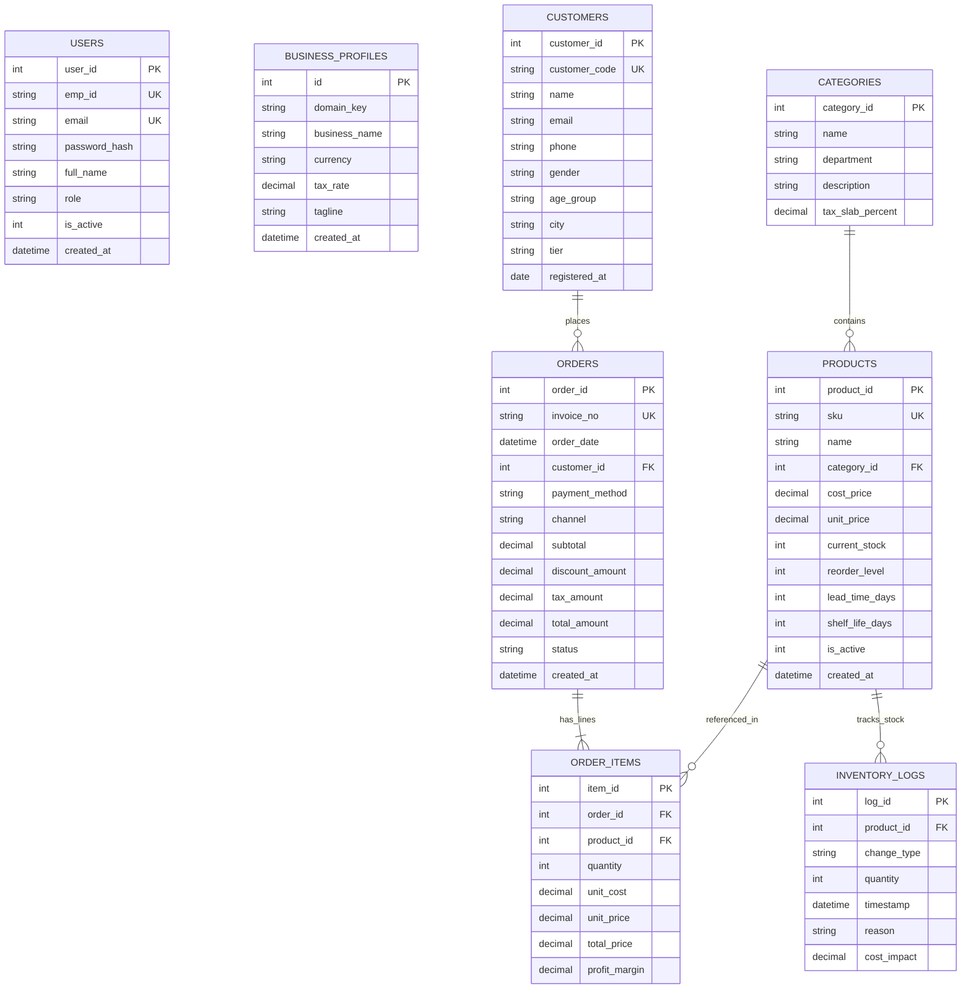
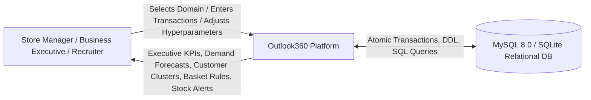
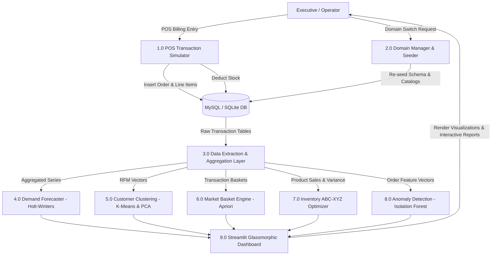
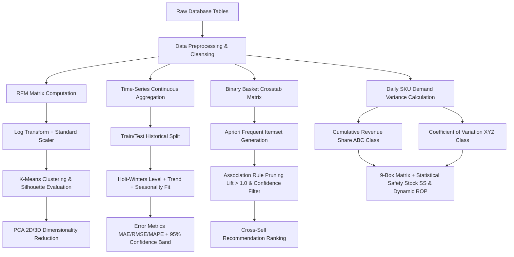
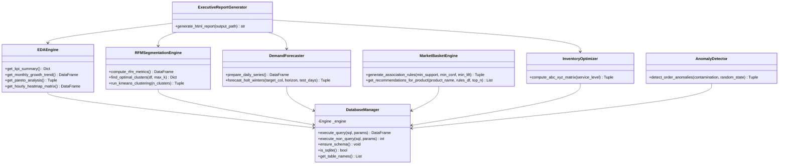
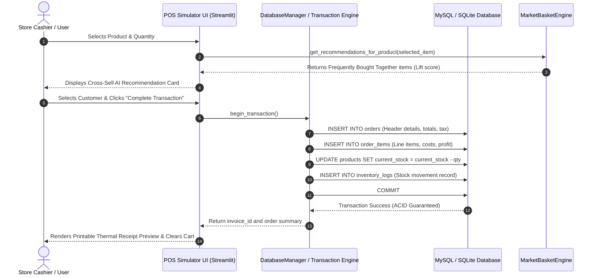

# System Design Document (SDD)

# Outlook360: Enterprise Architecture, ER Diagrams, DFD & UML Specifications

---

## 1. Entity-Relationship Diagram (ERD)

The database follows a **Normalized 3NF Relational Structure** that simultaneously functions as an analytical **Star Schema** with `orders` and `order_items` as Fact tables and `products`, `categories`, `customers`, and `inventory_logs` as Dimension tables.

---

## 2. Data Flow Diagrams (DFD)

### 2.1 DFD Level 0 (Context Level Diagram)

### 2.2 DFD Level 1 (System Decomposition)

### 2.3 DFD Level 2 (Data Science Pipeline Flow)

---

## 3. UML Class Diagram

---

## 4. UML Sequence Diagram (Real-Time POS Billing Flow)

---

## 5. Performance Indexing & Query Optimization Strategy

To ensure zero latency across analytical aggregations and machine learning model training, the relational schema enforces non-clustered B-Tree indexing on all foreign keys and temporal filter columns:

1. `idx_orders_date`: Accelerates time-series slicing and daily revenue aggregation (`GROUP BY DATE(order_date)`).
2. `idx_order_items_order`: Optimizes inner joins between orders header and line items.
3. `idx_order_items_product`: Accelerates product-level velocity and Market Basket crosstab pivoting.
4. `idx_products_category`: Speeds up department and category hierarchy rollups.
5. `idx_inventory_logs_timestamp`: Enables fast chronological stock ledger audits.
